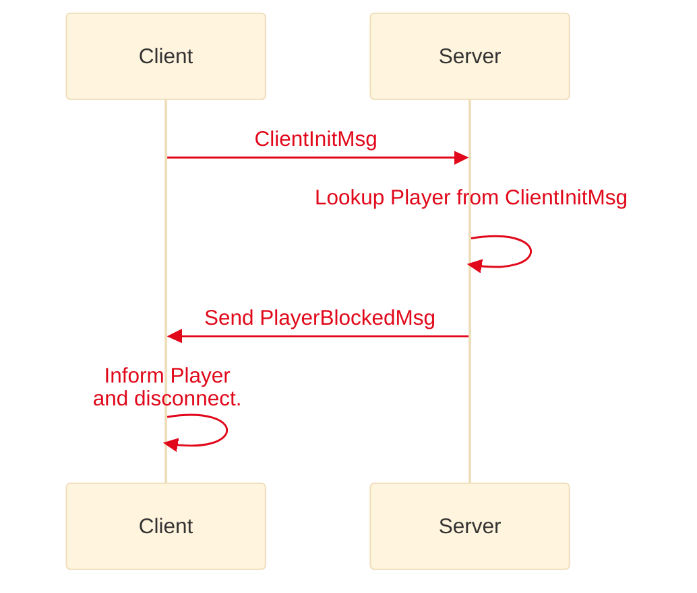
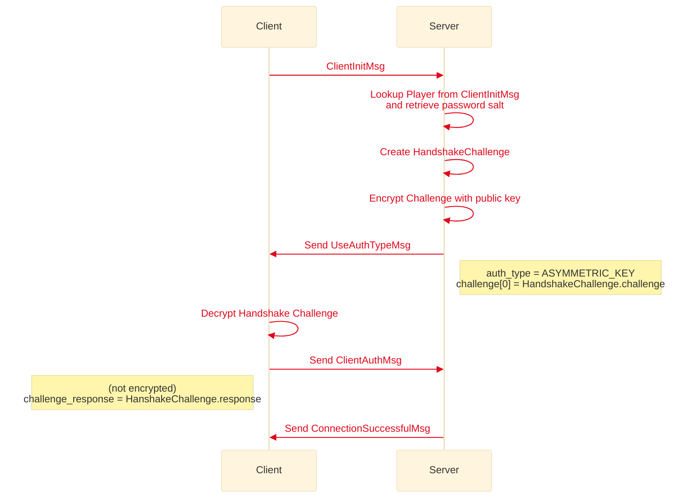
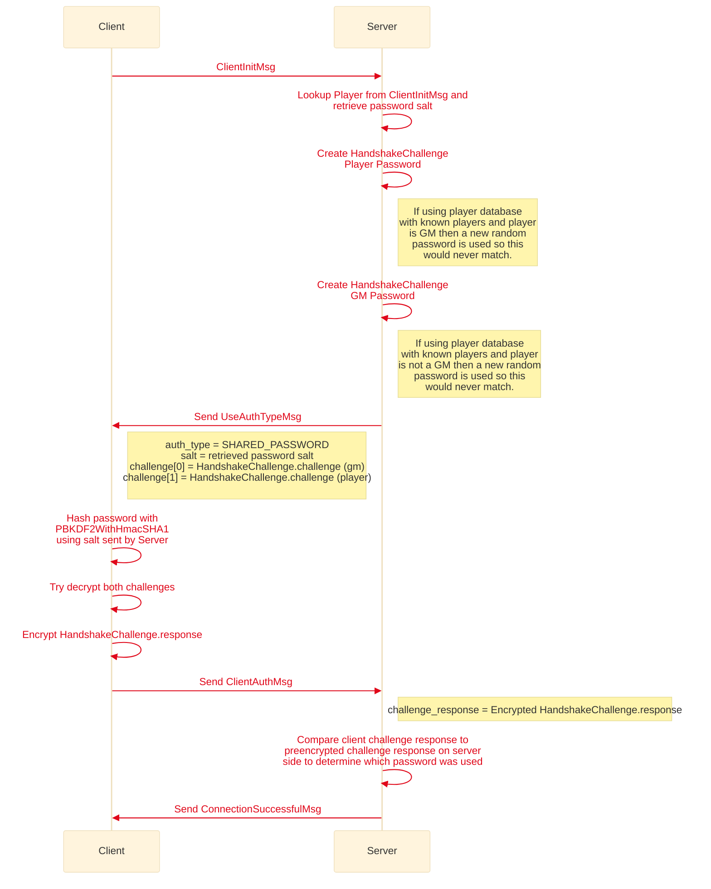

# Handshake and Authentication
Last Updated: MapTool 1.10

The handshake and authentication occurs via protobuf messages before any Hessian serialization occurs. Once the handshake and authentication is succcessful only then will Hessian serialization be used for passing messages between server and client. (This is likely to change in MapTool 1.11 or MapTool 1.12 where Hessian will be completely replaced by protobuf)

## Blocked Player
If a player is blocked then the Server will inform the client of this before trying perform any password or public key authentication.



## Player using public key authentication
If the player is not blocked and is authenticating with a public key then the following authentication/handshake sequence occurs. The public key has to be known to the Server before a player can attempt to authenticat this way.



## Player using shared password authentication
If the player is not blocked and is authentiating with a shared password the following authentication/handsake squence occurs. As a shared password could be per player or role based (i.e. a single password for players and another single password for GMs) the server creates a challenge for both GM and Player and which ever the client can respond to determines the role. If a password database is used where the role is recorded and the Server knows if the player is a GM or not then a new random password will be used to encrypt the non pertinant handshake challenge ensureing it should never match.




## Protocal Buffers
```protobuf reference title="Handshake Protocal Buffers"
https://github.com/RPTools/maptool/blob/develop/src/main/proto/handshake.proto
``` 