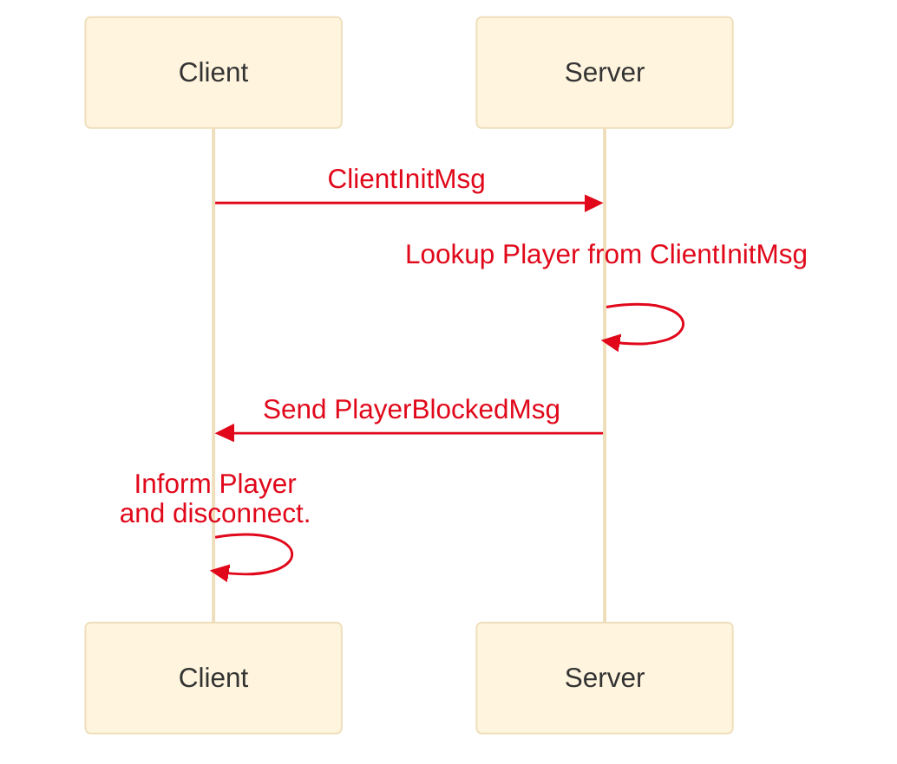
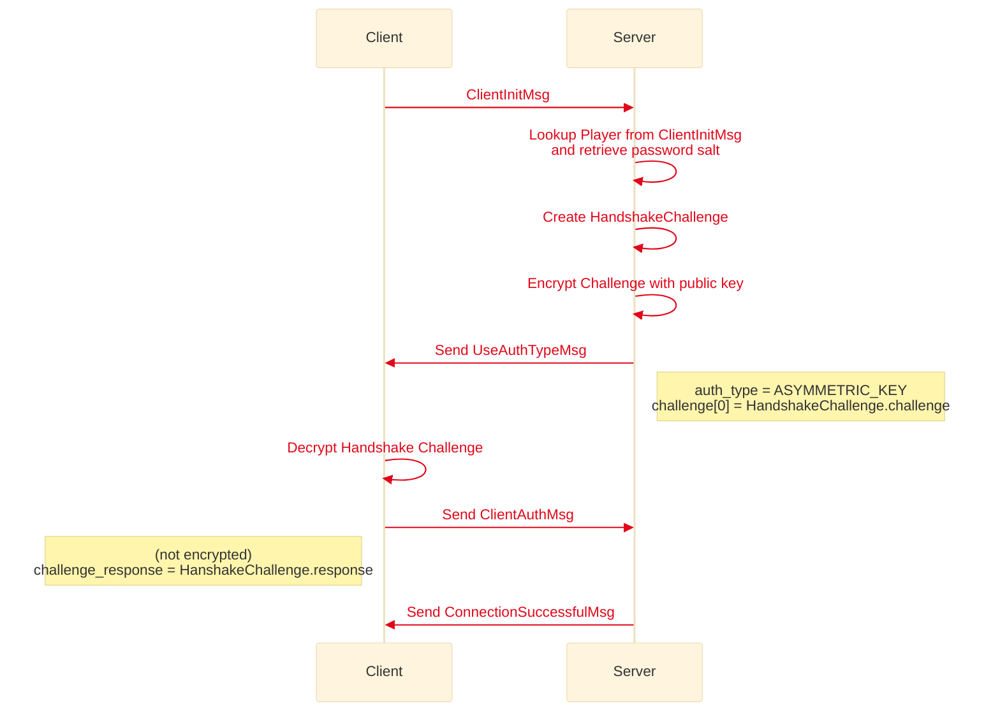
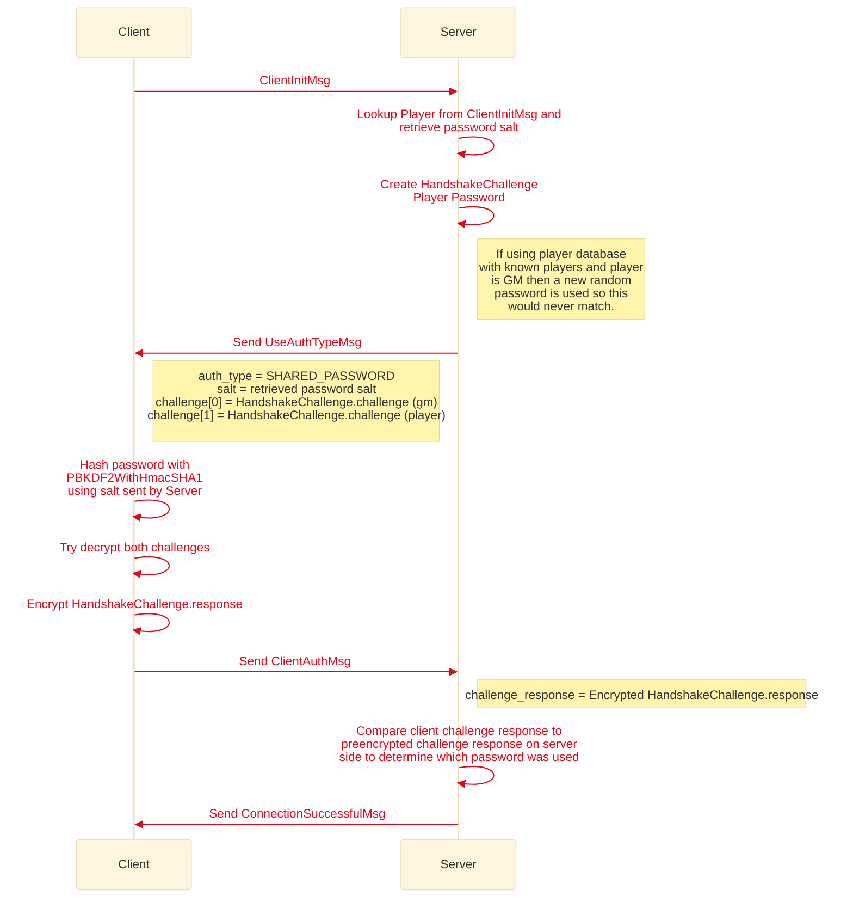

# Handshake and Authentication
Last Updated: MapTool 1.10

The handshake and authentication occurs before Hessian is used

## Blocked Player

## Player using public key authentication

## Player using shared password authentication
